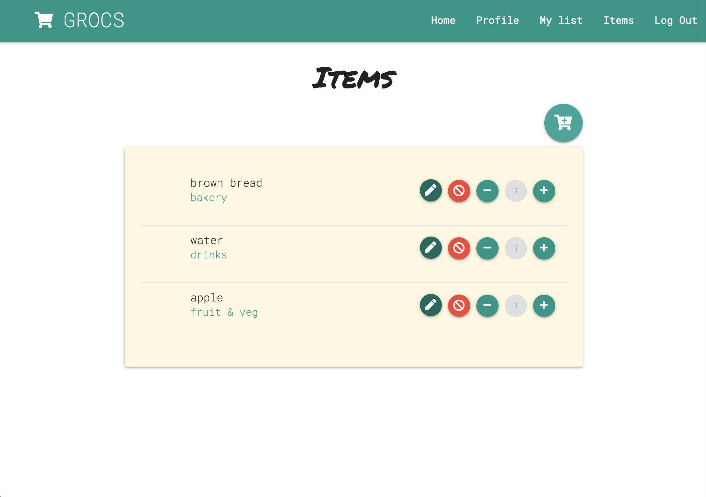
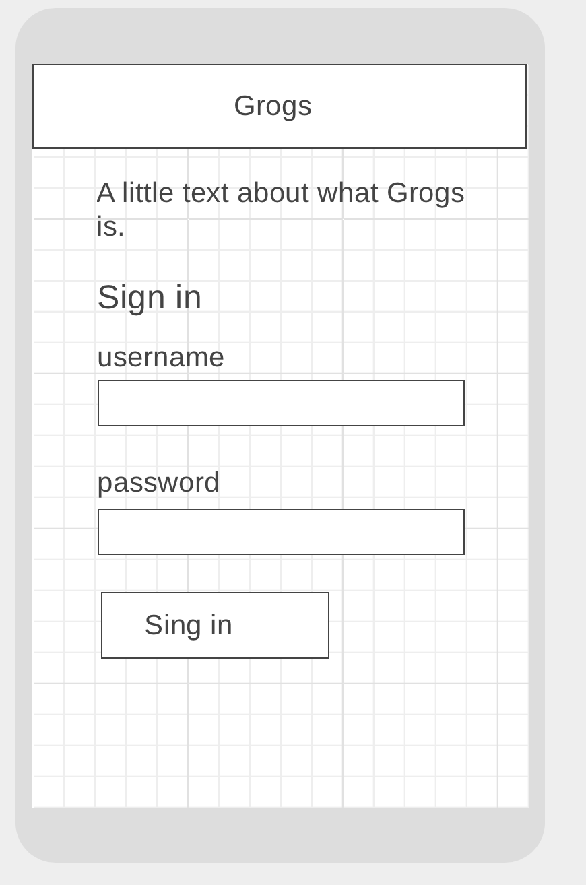
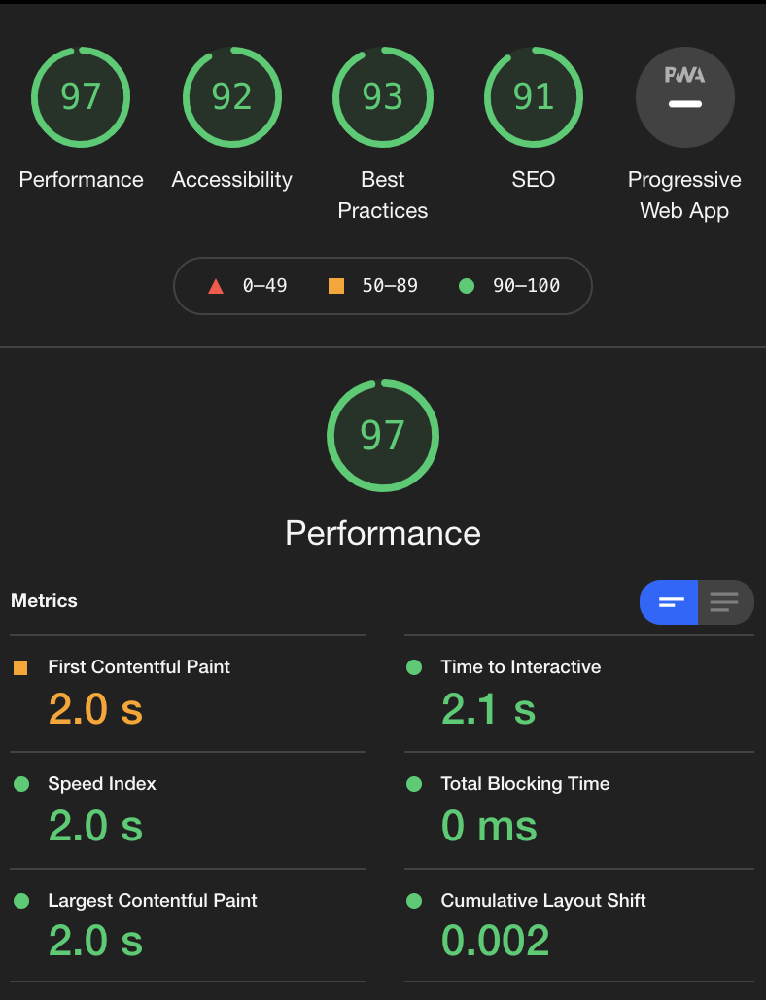

# GROCS

Visit GROCS [here](https://grocs.herokuapp.com/home).


# MP3
Milestone project 3

### User Stories

## User Experience (UX)
* First time visitor goals
	* As a first time visitor, I want to instantly understand the main purpose of the site: to keep grocery lists.
	* As a first time visitor I want to be able to sign up quickly and start using this website.
* Returning visitor goals
	* As a returning visitor, I want to access the list that I left on my last visit. 
* Frequent user goals
	* As a frequent visitor I want to be able to quickly view and make changes to the list I left before. 

### Design
* Colour Scheme
	* For the colour scheme white, black, teal and light amber are used. The amber is used to resemble the colour of paper or a postit note. 
* Typography
	* The main font family used is Roboto Mono, which falls back onto monospace if unavailable. 
	* The secondary font family that is used for titles is Permanent Marker, which falls back onto cursive if unavailable. 


### Wireframes
| Login page mobile | List page mobile |
| ---------------- | --------------- |
|  |  |

## Features
* Responsive on mobile device as well as desktop sizes.
* No Personal Identifiable Information from the user is taken into this project. 
* Privacy is granted by using Werkzeug privacy features.
* CRUD functionality with database.  


## Technologies used

### Languages used
* [HTML5](https://en.wikipedia.org/wiki/HTML5)
* [CSS3](https://en.wikipedia.org/wiki/Cascading_Style_Sheets)
* [JavaScript](https://en.wikipedia.org/wiki/JavaScript)

### Frameworks, Libraries & Programs Used
* [Google Fonts](https://fonts.google.com/)
	* Goole Fonts were used to import the Permanent Marker and the Roboto Mono fonts into the style.css file. This is used on all pages of the project.
* [Font Awesome](https://fontawesome.com/)
	* Font Awesome was used for the icon elements on the registration page.
* [Wireframes|cc](https://wireframe.cc)
	* Wireframes|cc is used for the initial wireframes.
* [Materialize](https://materializecss.com)
	* Materialize was used for the front end framework. 
* [jQuery](https://jquery.com/)
	* jQuery has been used wherever JavaScript has been implemented.
* [MongoDB](https://www.mongodb.com/)
	* MongoDB was used as the database for this project.
* [Flask](https://flask.palletsprojects.com/en/2.0.x/)
	* Flask was used to build this python application and for template enheritance. 
* [Werkzeug](https://pypi.org/project/Werkzeug/)
	* Werkzeug was used to facilitate secure log in.
* [Heroku](http://www.heroku.com)
	* Heroku was used to connect the database to the application.
* [Git](https://git-scm.com/)
	* Git was used for version control to push and pull from and to GitHub.
* [GitHub](https://github.com/)
	* GitHub is being used to store the project and its code.

### Data framework
For the data framework MongoDB was used. The following data structures are used and linked together: 

* categories
    * id
    * category_name
    * fa_icon
* items
    * id
    * category_name
    * item_name
    * count
    * created_by
* users
	* id
    * username
    * password

Categories are set and not changeable by application users. Items however can be edited if the user.username matches the item.created_by. Passwords are secured by Werkzeug. 

## Testing

The testing of CSS and HTML was done through W3C markup Validator and the W3C CSS Validator Services. The page was tested and validated only with errors related to Flask elements, which are expected. Python code was tested for PEP8 compliance through TutorialPoint

* [W3C Markup Validator](https://jigsaw.w3.org/css-validator/#validate_by_input)
* [W3C Nu HTML Checker](https://validator.w3.org/nu/#textarea)
* [TutorialPoint](https://www.tutorialspoint.com/online_python_formatter.htm)
* JavaScript was tested through [JSHint](https://jshint.com) and returned no errors.

### User stories testing

| User story | Testing |
| ---------------- | --------------- |
| As a first time visitor, I want to instantly understand the main purpose of the site: to keep grocery lists. | The purpose and functionality of the website is stated on the home page. The purpose of each other page and functionality is listed on the top of the page to guide the user through it, in case the design of the page wouldn't be intuitive enough. |
| As a first time visitor I want to be able to sign up quickly and start using this website. | The home page and the navbar provides clear linkage to where to sign up or sign in. |
| As a returning visitor, I want to access the list that I left on my last visit. | Once logged in, the main shopping list is easily accessible by either going through the navbar, or by clicking the logo. The list will be in the state that the user left it, thanks to using a server based data base. |
| As a frequent visitor I want to be able to quickly view and make changes to the list I left before. | When viewing the list, there are quick action buttons available per item on the list. Functions include, removing, editing, removing one, or adding one. |


### Responsiveness testing

Responsiveness has been further tested on the below areas by the use of Google Chrome's inspector function. Here I have inspected all responsiveness and readability on all devices available on the following areas:
| Test page/area | Responsive? | Further comments |
| ---------------- | --------------- | --------------- | 
| Navigation | Yes | Navigation interface scales well for desktop and smaller devices. Navbar collapses into a burger button on smaller devices responsively. | 
| Categories | Yes | Grid structure maintained on all devices. Also search area and functionality functions as expected. |
| Shopping, Pick item | Yes | Buttons now move under the category on smaller devices. Line out is still on the right for easy use. Text remains readable. |
| Add item, Edit item | Yes | No abnormalities found. Functionality and readability remains. |
| Log in | Yes | No abnormalities found. Lay out remains clean and scales well for smaller devices. |


### Further testing

Further testing that has been done is as listed below.

| Test area | Further comments |
| ---------------- | --------------- |
| UI | All fonts are used well and backed up well on all devices. Inspected areas manually. UI is clean and readable on all tested device sizes above. |
| Hrefs, buttons and other links | On all pages, hrefs, links and button functionality has been tested by manually clicking these and observing the results. Also tested that all pages are references. No links are broken. |
| User experience | For (first time) user stories, I have asked friends and family to try out the application without any instructions and to then give me feedback on their experiences. There were no major bugs found and UI was found to be non-ambiguous and easy to follow. |
| Functions | functions have been bested by using the page and trying to break it. Seems to work smoothly. |
| Input | Validation of user input is being validated for usernames and passwords. Invalid input results in an appropriate flash message. |
| Cookies | Pages have been tested with and without cookies enabled |
| Navigation | Pages are linked from multiple places where user experience would ask for it. For example, from the log in page an extra link to the register page is available and visa versa. |
| Database | Database implementation and forms has been tested manually and works well. User can only access items that they are meant to access, update and remove according to the defensiveness principles. Also sorting of database elements is confirmed to work as expected. |
| Deployment | Auto-deployment from GitHub has been turned on and is confirmed to work. | 

#### Lighthouse performance



Performance on Chrome Lighthouse testing shows very promissing responsiveness as is shown in the screenshot above, with scores over 90%. 

### Known bugs
* A major shortcoming for this application is the data types used. Ideally, categories should include the items in one structure. If I had to restart this project, I would take a different approach here.
* No functionality is in place at the moment to remove a user and associated items. This can be added at a later stage but was deemed unnecessary by my mentor for now.
* Initialising of items takes a long time. Ideally a visual aid should be shown to indicate that initialisation is in progress.
* Wireframes for homepage got lost.

## Deployment

### Private website

The website is hosted through Heroku. It is found [here](https://grocs.herokuapp.com/home).

### Forking the GitHub Repository

By forking the GitHub Repository we make a copy of the original repository on our GitHub account to view and/or make changes without affecting the original repository by using the following steps...

1. Log in to GitHub and locate the [GitHub Repository](https://github.com/jildourixt/grocs.git)
2. At the top of the Repository (not top of page) just above the "Settings" Button on the menu, locate the "Fork" Button.
3. You should now have a copy of the original repository in your GitHub account.

### Making a Local Clone

1. Log in to GitHub and locate the [GitHub Repository](https://github.com/jildourixt/grocs.git)
2. Under the repository name, click "Clone or download".
3. To clone the repository using HTTPS, under "Clone with HTTPS", copy the link.
4. Open Git Bash
5. Change the current working directory to the location where you want the cloned directory to be made.
6. Type git clone, and then paste the URL you copied in Step 3.
``` 
$ git clone https://github.com/jildourixt/grocs.git
```
7. Press Enter. Your local clone will be created.
8. Your local copy can be run with python3, using the following command:
```
python3 app.py
```

## Credits

### Acknowledgements
* My mentor for continuous helpful feedback.
* Tutor support at Code Institute for their support and materials.
* The inital structure for this project is heavily based on the mini project of the Code Institute for the Milestone 3 project. Further implementation for functionality is added on top of this. Many thanks and credits for this. 